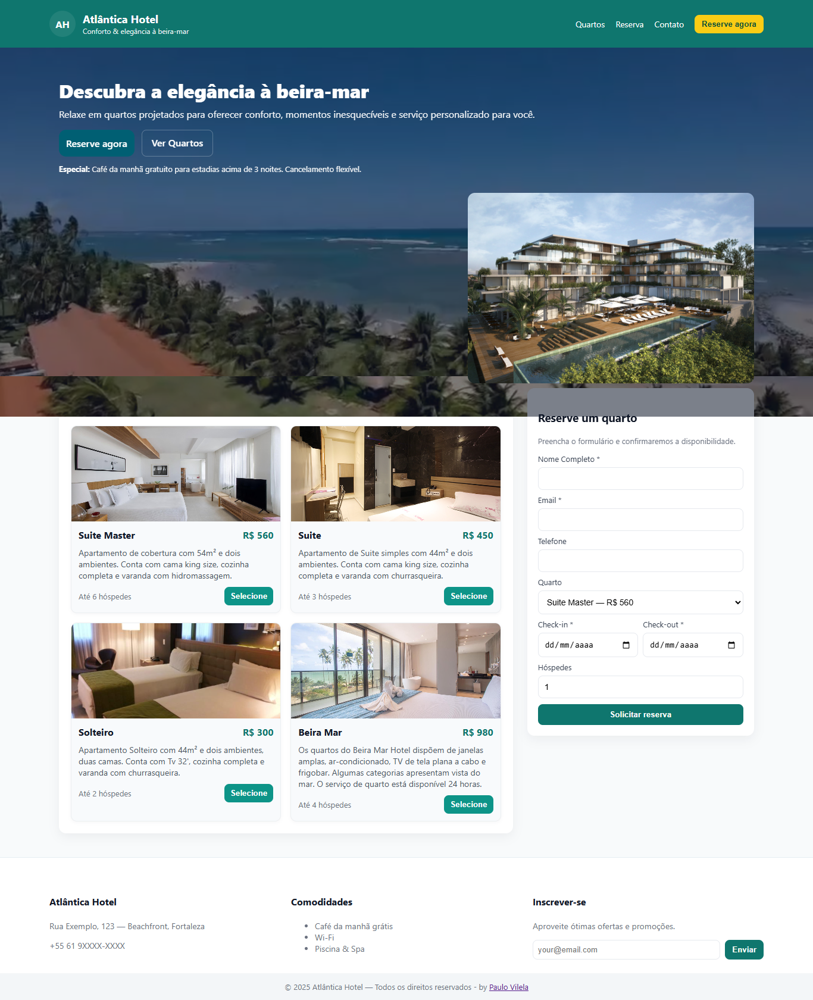

# Atlantica Hotel 🏨

Sistema completo de gestão do **Atlantica Hotel**, dividido em **backend (Java + Spring Boot + PostgreSQL)** e **frontend (React)**.  
O objetivo é gerenciar reservas, clientes, quartos e manter uma interface moderna para o usuário final.

---

## 🚀 Tecnologias Utilizadas

### Backend
- **Java 17+**
- **Spring Boot 3**
- **Spring Web**
- **Spring Data JPA**
- **PostgreSQL**
- **Maven**

### Frontend
- **React 18**
- **Tailwind**
- **CSS**



---

## 📂 Estrutura do Projeto

```
atlantica-hotel/
│── atlantica-backend/   # Código do servidor (API REST)
│── atlantica-frontend/  # Código do cliente (interface React)
```

---

## ⚙️ Configuração do Backend

### 1. Criar Banco de Dados
No PostgreSQL, crie o banco:
```sql
CREATE DATABASE atlantica_hotel;
```

### 2. Configurar `application.properties`
No arquivo `atlantica-backend/src/main/resources/application.properties`:
```properties
spring.datasource.url=jdbc:postgresql://localhost:5432/atlantica_hotel
spring.datasource.username=seu_usuario
spring.datasource.password=sua_senha

spring.jpa.hibernate.ddl-auto=update
spring.jpa.show-sql=true
spring.jpa.properties.hibernate.format_sql=true
```

### 3. Rodar o backend
Dentro da pasta `atlantica-backend`:
```bash
mvn spring-boot:run
```

A API estará disponível em:
```
http://localhost:8080
```

---

## 🎨 Configuração do Frontend

### 1. Instalar dependências
```bash
cd atlantica-frontend
npm install
```

### 2. Rodar o projeto
```bash
npm start
```

O frontend rodará em:
```
http://localhost:3000
```

---

## 🔗 Integração Frontend + Backend
O React consumirá a API do Spring Boot através dos endpoints REST.  
Exemplo de chamada no frontend:
```javascript
fetch("http://localhost:8080/api/quartos")
  .then(res => res.json())
  .then(data => console.log(data));
```

---

## ✅ Funcionalidades
- Cadastro de clientes API  👤  
- Gerenciamento de quartos API 🛏️  
- Controle de reservas 📅  
- Interface web moderna 💻  

---

## 👨‍💻 Autor
Desenvolvido por **Paulo Vilela – DEV** 🚀
